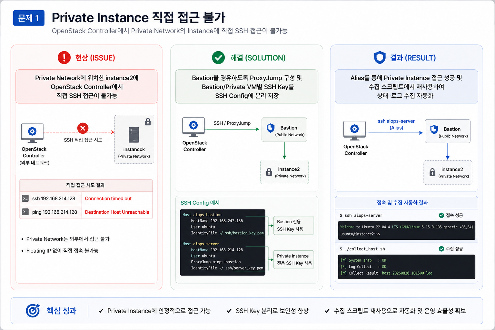
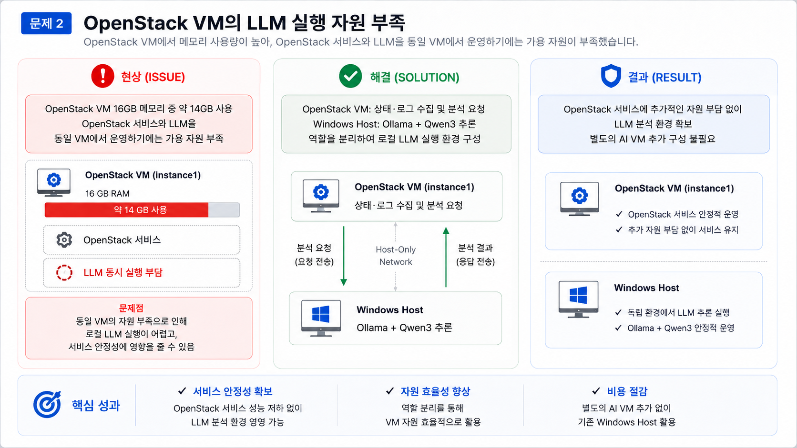
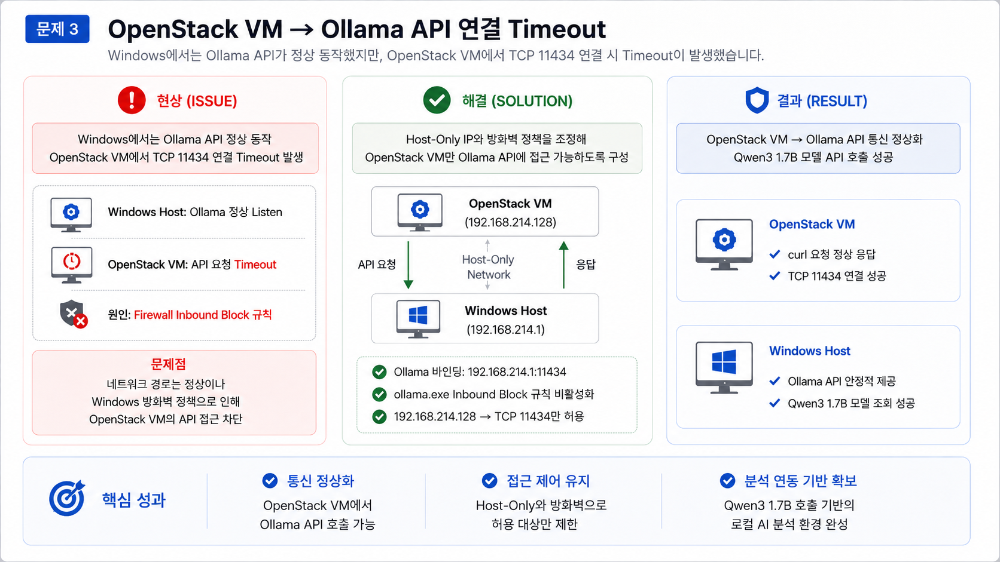
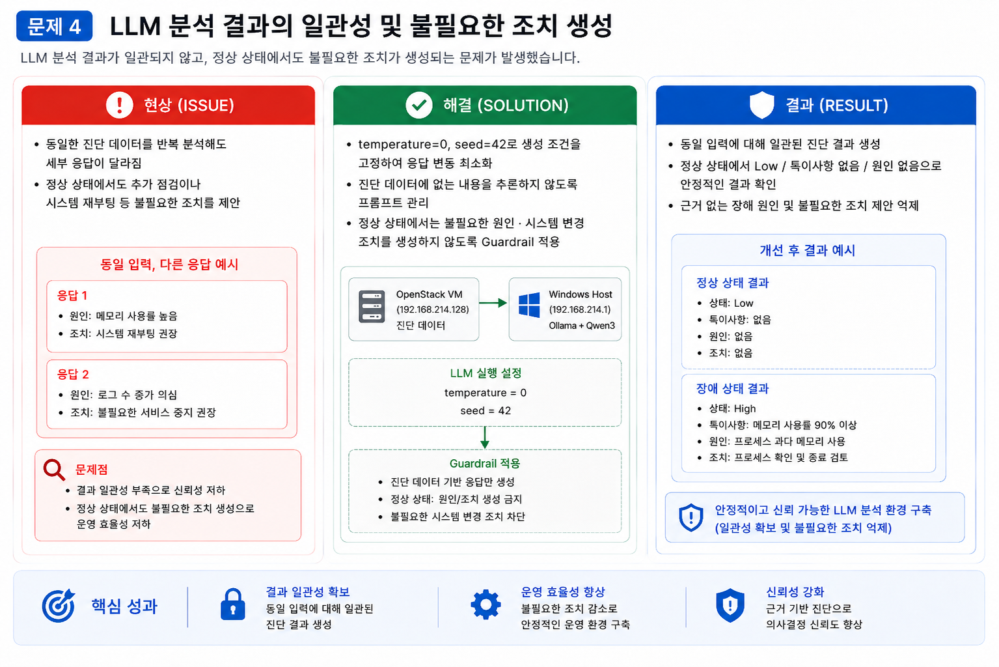

### 1. 프로젝트 개요

- **배경**
    
    클라우드 장애 진단 시 서버, 네트워크, 로드밸런서 상태와 VM 내부 로그를 각각 확인해야 하며, 여러 위치에 분산된 정보를 운영자가 직접 종합해야 하는 반복 작업이 발생한다.
    
    이를 줄이기 위해 OpenStack 인프라 상태와 Linux VM의 시스템·오류 로그를 자동 수집해 하나의 진단 데이터로 통합하고, 로컬 LLM을 활용해 운영 상태를 분석하는 환경을 구축했다.
    
- **목표**
    1. OpenStack 인프라와 Linux VM의 상태·로그 자동 수집
    2. 분산된 운영 데이터를 하나의 진단 데이터로 통합
    3. 로컬 LLM을 활용한 이상 징후·원인 후보·권장 조치 분석
    4. 외부 API 비용 없이 반복 테스트 가능한 AI 분석 환경 구성

---

### 2. 전체 환경 구성

**아키텍처 다이어그램**


---

### 3. 주요 기술 선택

| 구분 | 선택 기술 | 선택 이유 |
| --- | --- | --- |
| Cloud | OpenStack | 기존 IaC 기반 클라우드 환경을 활용하고 추가 퍼블릭 클라우드 비용 없이 실습 가능 |
| Collection | Shell Script | OpenStack CLI와 Linux 명령을 이용한 상태·로그 수집을 간단하게 자동화 |
| Analysis | Python | 진단 로그 처리와 Ollama HTTP API 연동 |
| LLM Runtime | Ollama | 로컬 LLM 실행 및 HTTP API 기반 외부 연동 가능 |
| LLM | Qwen3 1.7B | 제한된 로컬 자원에서 실행하면서 다국어·Reasoning·향후 Tool 연동 가능 |
| Network | Host-Only | Ollama API를 외부 네트워크에 노출하지 않고 OpenStack VM과 로컬 PC 간 통신 구성 |

모델 선정 기준:

> **무료 로컬 실행 / CPU 실행 / 저장공간 / 한국어 / 운영 분석 / Tool 확장성**
> 

> 제한된 로컬 자원에서 로그 분석과 향후 Tool/Agent 연동까지 고려해 Qwen3 1.7B를 초기 모델로 선정.
> 

| 모델 | 크기 | 판단 |
| --- | --- | --- |
| Gemma 3 1B | 815MB | 최소 자원에 유리 |
| Llama 3.2 1B | 1.3GB | 경량, 한국어 활용은 후순위 |
| **Qwen3 1.7B** | **1.4GB** | **자원·다국어·Reasoning·Tool 확장 균형** |
| Llama 3.2 3B | 2.0GB | 상대적 자원 증가 |
| Phi-4 Mini | 2.5GB | 향후 성능 개선 후보 |
| Gemma 3 4B | 3.3GB | 자원 부담 증가 |

---

## 4. 클라우드 상태 및 로그 수집


### OpenStack 인프라 상태 수집


---

### Private 인스턴스 상태 및 오류 로그 수집


---

## 5. AI 진단 분석

```jsx
상태 요약
→ 이상 징후
→ 원인 후보 + 근거
→ 추가 확인 항목
→ 권장 조치
```

- 제공된 진단 데이터만을 근거로 분석하고, 근거가 부족한 내용은 `확인 필요`로 표시하도록 프롬프트를 구성
- 동일 입력의 출력 일관성을 높이고, 정상 상태에서 불필요한 원인·조치를 생성하지 않도록 프롬프트와 생성 설정을 조정


---

## 6. 기술 이슈와 해결 전략

### 문제 1. Private VM 직접 접근 불가



### 문제 2. OpenStack VM의 LLM 실행 자원 부족



### 문제 3. OpenStack VM → Ollama API 연결 Timeout



### 문제 4. LLM 분석 결과의 일관성 및 불필요한 조치 생성



---

## 7. 결과

- OpenStack 인프라와 Private VM의 상태·오류 로그를 자동 수집하고 하나의 `diagnostic` 데이터로 통합
- Ollama + Qwen3 1.7B와 연동하는 Python 기반 로컬 AI 진단 분석기 구현
- 상태 요약 / 이상 징후 / 원인 후보 / 추가 확인 / 권장 조치 형태로 분석 결과를 구조화하고 파일로 저장

---

## 8. 한계 및 확장 계획

**현재 한계**

- 정상 환경 중심의 LLM 진단 흐름 구현
- 실제 장애 유형별 분석 정확도 검증 필요
- AI 판단 기반 자동 대응 미구현

**확장 계획**

- 실제 장애 시나리오 기반 분석 검증
- 장애 유형별 Runbook 연결
- 운영자 승인 기반 자동 조치
- 조치 후 재진단 및 정상화 확인

```
실제 장애 시나리오 검증
        ↓
AI 분석 정확도 확인
        ↓
장애 유형별 Runbook 연결
        ↓
운영자 승인 기반 자동 조치
        ↓
재진단 및 정상화 확인
```