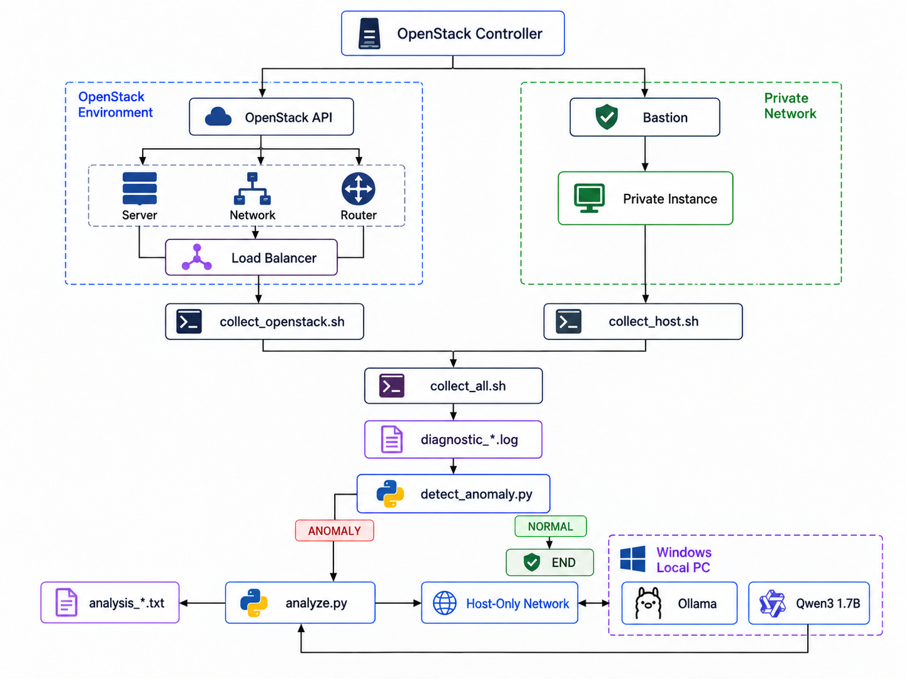

### 1. 프로젝트 개요

- **배경**
    
    클라우드 장애 진단 시 서버, 네트워크, 로드밸런서 상태와 VM 내부 로그를 각각 확인해야 하며, 여러 위치에 분산된 정보를 운영자가 직접 종합해야 하는 반복 작업이 발생. 이를 줄이기 위해 OpenStack 리소스 상태와 Private Instance의 Linux 운영 데이터를 자동 수집하고, Desired State 기반 이상 탐지와 로컬 LLM 분석을 결합한 운영 진단 자동화 환경을 구축.
    
- **목표**
    1. OpenStack 리소스와 Private Instance의 상태·로그 자동 수집
    2. Desired State 기반 `NORMAL / ANOMALY` 판정 및 이상 시 LLM 분석
    3. Observation 기반 진단 결과와 Trace 저장

---

### 2. 전체 환경 구성

**아키텍처 다이어그램**

---

### 3. 주요 기술 선택

| 구분 | 기술 | 선택 이유 |
| --- | --- | --- |
| Platform | OpenStack | 기존 IaC 환경 활용, 추가 퍼블릭 클라우드 비용 없이 반복 실습 |
| Collection | Shell Script | OpenStack CLI·SSH·Linux 명령 기반 상태/로그 수집 |
| Analysis | Python | 상태 비교, Observation 구조화, LLM 호출·검증 및 결과 처리 |
| LLM | Ollama + Qwen3 1.7B | 제한된 로컬 자원에서 실행 가능한 한국어·구조화 출력 모델 |

모델 선정 기준:

**무료 로컬 실행 / CPU 실행 / 저장공간 / 한국어 / 운영 분석 / Tool 확장성**

> 제한된 로컬 CPU 환경에서 반복 테스트가 가능하면서 한국어 처리와 구조화된 진단 출력이 가능한 모델을 우선 고려해 Qwen3 1.7B를 초기 모델로 선정.

---

## 4. 클라우드 상태 및 로그 수집

### OpenStack 인프라 상태 수집

---

### Private 인스턴스 상태 및 오류 로그 수집

---

**진단 흐름 및 특징**

- Desired State와 실제 상태를 비교해 `NORMAL / ANOMALY` 판정
- 이상 탐지 시 상세 상태·Journal을 Observation으로 구조화
- 상태 판정은 Python, 장애 의미 해석은 LLM으로 역할 분리
- Observation 참조 검증 후 Report/Trace로 저장해 진단 과정 추적

---

## 5. 기술 이슈와 해결 전략

### 문제 1. Private VM 직접 접근 불가

### 문제 2. OpenStack VM의 LLM 실행 자원 부족

### 문제 3. OpenStack VM → Ollama API 연결 Timeout

### 문제 4. LLM 분석 결과의 일관성 및 불필요한 조치 생성

---

## 6. 구현 결과 및 검증

**서로 다른 2가지 서비스 장애를 의도적으로 발생시켜 진단 파이프라인을 검증**

- **서비스 실행 실패:** 비정상 종료 코드를 반환하는 `/bin/false`를 실행해 **서비스 실행 실패를 재현**
- **서비스 시작 Timeout:** 30초 실행 프로세스에 시작 제한시간을 5초로 설정해 Timeout 장애를 재현
- 두 장애에서 **이상 탐지 → 상세 수집 → Observation → LLM 진단** 전체 흐름 동작 확인

**주기 실행 자동화**

- `systemd timer`로 **10분 주기 전체 진단 파이프라인 반복 실행**
- Wrapper에서 `keystonerc_admin`을 로드해 systemd 환경에서도 OpenStack API 호출 가능

**최종 결과**

- OpenStack·Private Instance 상태/로그 자동 수집 및 Rule 기반 이상 판정
- 이상 발생 시에만 LLM을 호출하는 **선택적 AI 진단 구조 구현**
- Controlled Failure로 **End-to-End 진단 흐름 검증**
- 주기 실행까지 연결해 **반복 가능한 진단 자동화 환경 구성**

---

## 7. 한계 및 확장 계획

**현재 한계**

- Qwen3 1.7B의 제한된 추론 성능으로 일부 systemd 의미 해석 오류 존재
- 현재 LLM은 대응 방안을 제안하며 실제 조치는 실행하지 않음
- 단일 실습 환경 중심의 Desired State 구성

**확장 계획**

- 다중 Host 및 역할별 Desired State
- 고성능 LLM 비교 및 Finding 상관관계 분석
- Runbook 기반 운영자 승인형 복구 자동화
- 실행 단위 Run ID 도입